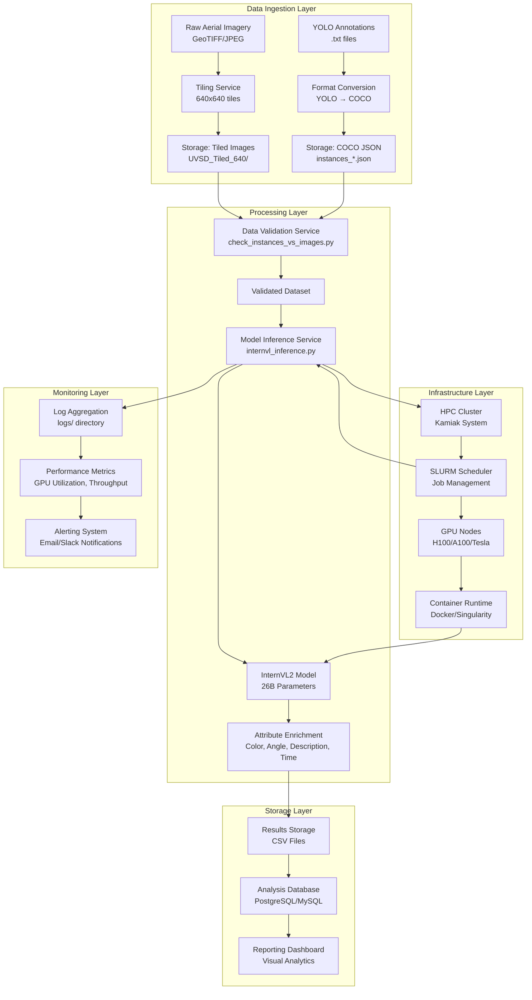

# UVSD Enrichment High-Level Architecture

## System Overview
The UVSD Enrichment system is a distributed computer vision pipeline designed for processing aerial imagery to detect and enrich vehicle instances using advanced vision-language models. The architecture supports batch processing on HPC clusters with GPU acceleration.

## Architectural Diagram



## Component Details

### 1. Data Ingestion Layer

#### 1.1 Image Tiling Service
- **Purpose**: Convert large aerial images into manageable 640x640 tiles
- **Input**: High-resolution geospatial imagery (GeoTIFF, JPEG)
- **Output**: Tiled image dataset in YOLO directory structure
- **Algorithm**: Sliding window with configurable overlap
- **Storage**: `UVSD_Tiled_640/YOLO_Dataset_Tiled_640/images/`

#### 1.2 Annotation Conversion Service
- **Purpose**: Convert YOLO format annotations to COCO JSON format
- **Input**: YOLO .txt files with normalized coordinates
- **Output**: COCO-compatible JSON annotation files
- **Transformation**: Normalized → pixel coordinate conversion
- **Storage**: `instances_train.json`, `instances_val.json`

### 2. Processing Layer

#### 2.1 Data Validation Service
- **Component**: `check_instances_vs_images.py`
- **Purpose**: Validate correspondence between images and annotations
- **Checks**:
  - Image file existence
  - Annotation format compliance
  - Bounding box coordinate validity
  - Segmentation polygon integrity
- **Output**: Validation report and error logging

#### 2.2 Model Inference Service
- **Component**: `internvl_inference.py`
- **Purpose**: Run InternVL2 model on validated dataset
- **Input**: Validated images + COCO annotations
- **Model**: InternVL2-5-26B (vision-language model)
- **Output**: Enriched vehicle attributes
- **Attributes Generated**:
  - Vehicle color
  - Viewing angle
  - Natural language description
  - Time of day classification

### 3. Storage Layer

#### 3.1 Raw Data Storage
- **Format**: Compressed ZIP archives
- **Location**: Project root directory
- **Retention**: Long-term archival
- **Backup Strategy**: Regular backups to tape/cloud

#### 3.2 Processed Data Storage
- **Format**: Hierarchical directory structure
- **Location**: `UVSD_Tiled_640/`
- **Organization**: Train/Val splits with images/labels
- **Access Pattern**: Read-heavy, batch processing

#### 3.3 Results Storage
- **Format**: CSV files with enriched data
- **Location**: `results/` directory
- **File**: `vehicle_instance_analysis_val.csv`
- **Schema**: Annotation ID + enriched attributes
- **Query Interface**: Pandas/SQL for analysis

#### 3.4 Model Storage
- **Format**: Safetensors + configuration files
- **Location**: `models/InternVL2_5-26B/`
- **Size**: ~50GB (distributed across 11 shards)
- **Versioning**: Git LFS for model weight management

### 4. Infrastructure Layer

#### 4.1 HPC Cluster (Kamiak System)
- **Compute Nodes**: GPU-enabled nodes (H100, A100, Tesla)
- **Scheduler**: SLURM workload manager
- **Storage**: Parallel filesystem for high I/O
- **Networking**: High-speed interconnects

#### 4.2 Containerization
- **Runtime**: Docker/Singularity for reproducibility
- **Base Image**: CUDA-enabled PyTorch container
- **Dependencies**: Python, PyTorch, Transformers, OpenCV
- **Orchestration**: SLURM job arrays for parallel processing

#### 4.3 Batch Processing
- **Script**: `run_internvl.sbatch`
- **Configuration**: GPU resource requests, time limits
- **Parallelism**: Multiple concurrent inference jobs
- **Checkpointing**: Resume capability for long-running jobs

### 5. Monitoring Layer

#### 5.1 Log Management
- **Location**: `logs/` directory
- **Format**: Structured logging (JSON)
- **Rotation**: Daily log rotation
- **Analysis**: Error pattern detection

#### 5.2 Performance Metrics
- **GPU Utilization**: Memory usage, compute load
- **Throughput**: Images processed per hour
- **Latency**: Inference time per image
- **Accuracy**: Model confidence scores

#### 5.3 Alerting System
- **Channels**: Email, Slack, Webhook
- **Triggers**: Job failures, low accuracy, resource exhaustion
- **Escalation**: Multi-level notification based on severity

## Data Flow Architecture

### Batch Processing Pipeline
```
1. Data Preparation → 2. Validation → 3. Inference → 4. Storage → 5. Analysis
```

#### Phase 1: Data Preparation
- **Input**: Raw imagery + annotations
- **Process**: Tiling + format conversion
- **Output**: Standardized dataset
- **Tools**: Custom Python scripts, OpenCV

#### Phase 2: Validation
- **Input**: Standardized dataset
- **Process**: Cross-validation checks
- **Output**: Validated dataset
- **Tools**: `check_instances_vs_images.py`

#### Phase 3: Inference
- **Input**: Validated dataset
- **Process**: Model inference on GPU
- **Output**: Enriched attributes
- **Tools**: `internvl_inference.py`, InternVL2 model

#### Phase 4: Storage
- **Input**: Enriched results
- **Process**: CSV generation + database ingestion
- **Output**: Queryable results
- **Tools**: Pandas, SQLAlchemy

#### Phase 5: Analysis
- **Input**: Stored results
- **Process**: Statistical analysis + visualization
- **Output**: Insights + reports
- **Tools**: Matplotlib, Seaborn, Jupyter

## Scalability Considerations

### Horizontal Scaling
1. **Data Parallelism**: Process multiple image tiles concurrently
2. **Model Parallelism**: Distribute large model across multiple GPUs
3. **Pipeline Parallelism**: Overlap data loading with computation

### Vertical Scaling
1. **GPU Memory**: Larger batch sizes with more GPU memory
2. **CPU Cores**: Faster data preprocessing with more CPU cores
3. **Storage I/O**: Parallel filesystem for concurrent access

### Fault Tolerance
1. **Checkpointing**: Save intermediate results periodically
2. **Retry Logic**: Automatic retry on transient failures
3. **Data Validation**: Pre-flight checks before expensive computation

## Security Considerations

### Data Security
1. **Access Control**: Role-based access to sensitive data
2. **Encryption**: At-rest encryption for archived data
3. **Audit Trail**: Log all data access and modifications

### Model Security
1. **Model Integrity**: Checksums for model weights
2. **Input Validation**: Sanitize all model inputs
3. **Output Verification**: Validate model outputs for anomalies

### Infrastructure Security
1. **Network Isolation**: Private subnet for GPU nodes
2. **Container Security**: Regular vulnerability scanning
3. **Access Logging**: Comprehensive audit trails

## Deployment Architecture

### Development Environment
- **Local**: Docker containers for development
- **Testing**: Staging cluster with subset of data
- **Validation**: Automated testing pipeline

### Production Environment
- **HPC Cluster**: Kamiak system with GPU nodes
- **Orchestration**: SLURM for job scheduling
- **Monitoring**: Prometheus + Grafana dashboards

### Disaster Recovery
1. **Backup Strategy**: Regular backups of critical data
2. **Redundancy**: Multi-zone storage for high availability
3. **Recovery Plan**: Documented procedures for system restoration

## Performance Targets

### Throughput
- **Current**: ~100 images/hour on single GPU
- **Target**: ~1,000 images/hour with optimization
- **Scale**: ~10,000 images/hour with multi-node deployment

### Latency
- **Inference**: < 5 seconds per image
- **End-to-end**: < 10 minutes for 100-image batch
- **Data Loading**: < 1 second per tile

### Accuracy
- **Detection**: > 95% recall for vehicles
- **Enrichment**: > 90% accuracy for color/angle
- **Consistency**: > 95% agreement between runs

## Future Architecture Evolution

### Short-term (3-6 months)
1. **Streaming Pipeline**: Real-time processing capability
2. **Model Optimization**: Quantization for faster inference
3. **Cache Layer**: Redis for frequent data access

### Medium-term (6-12 months)
1. **Microservices**: Decompose monolithic pipeline
2. **Kubernetes**: Container orchestration for scalability
3. **Feature Store**: Centralized feature management

### Long-term (12+ months)
1. **Edge Deployment**: On-device inference capability
2. **Federated Learning**: Privacy-preserving model training
3. **Multi-modal Integration**: Combine with other sensor data