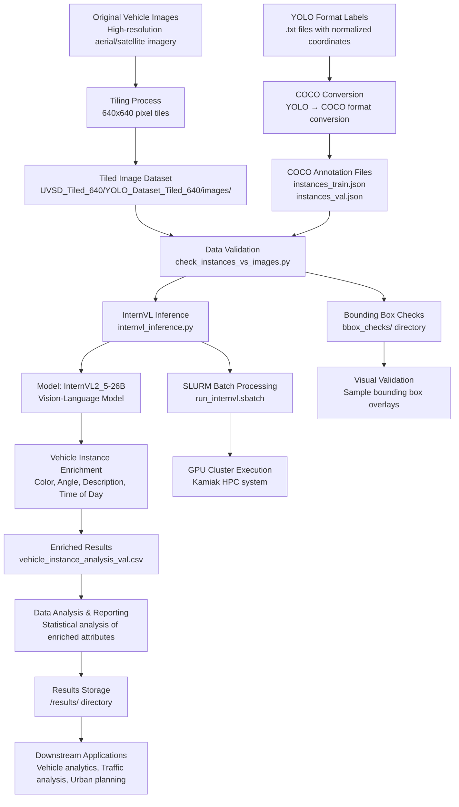

# UVSD Enrichment Data Flow Diagram

## Overview
This document describes the data flow for the UVSD (Urban Vehicle Scene Detection) Enrichment project, which processes vehicle detection data through a vision-language model pipeline.

## Data Flow Diagram

## Data Tables and Relationships

### Table 1: Images Table
| Column Name | Data Type | Description | Primary Key | Foreign Key |
|-------------|-----------|-------------|-------------|-------------|
| image_id | INTEGER | Unique identifier for each image | ✓ | |
| file_name | VARCHAR(255) | Path to image file relative to dataset root | | |
| width | INTEGER | Image width in pixels | | |
| height | INTEGER | Image height in pixels | | |
| tile_x | INTEGER | X-coordinate of tile origin (if tiled) | | |
| tile_y | INTEGER | Y-coordinate of tile origin (if tiled) | | |
| source_image | VARCHAR(255) | Original source image filename | | |

### Table 2: Annotations Table
| Column Name | Data Type | Description | Primary Key | Foreign Key |
|-------------|-----------|-------------|-------------|-------------|
| annotation_id | INTEGER | Unique identifier for each annotation | ✓ | |
| image_id | INTEGER | Reference to images table | | ✓ (images.image_id) |
| category_id | INTEGER | Vehicle category (0 = vehicle) | | ✓ (categories.category_id) |
| bbox | FLOAT[4] | Bounding box [x, y, width, height] | | |
| segmentation | TEXT | Polygon coordinates as JSON array | | |
| area | FLOAT | Area of bounding box in pixels² | | |
| iscrowd | BOOLEAN | Whether annotation is for a crowd | | |

### Table 3: Categories Table
| Column Name | Data Type | Description | Primary Key | Foreign Key |
|-------------|-----------|-------------|-------------|-------------|
| category_id | INTEGER | Unique identifier for category | ✓ | |
| category_name | VARCHAR(50) | Name of category (e.g., "vehicle") | | |
| supercategory | VARCHAR(50) | Higher-level category grouping | | |

### Table 4: Enriched Results Table
| Column Name | Data Type | Description | Primary Key | Foreign Key |
|-------------|-----------|-------------|-------------|-------------|
| result_id | INTEGER | Unique identifier for enrichment result | ✓ | |
| annotation_id | INTEGER | Reference to annotations table | | ✓ (annotations.annotation_id) |
| color | VARCHAR(50) | Predicted vehicle color | | |
| angle | VARCHAR(50) | Predicted viewing angle | | |
| description | TEXT | Detailed vehicle description | | |
| time_of_day | VARCHAR(50) | Time of day classification | | |
| confidence_score | FLOAT | Model confidence score (0-1) | | |
| processing_timestamp | TIMESTAMP | When enrichment was performed | | |

## Data Relationships
1. **One-to-Many**: One image can have multiple annotations (vehicles)
2. **One-to-One**: Each annotation has exactly one enrichment result
3. **Many-to-One**: Multiple annotations belong to one category
4. **Hierarchical**: Original images → Tiles → Annotations → Enriched Results

## Data Flow Stages

### Stage 1: Data Ingestion
- **Input**: High-resolution aerial/satellite imagery
- **Process**: Tiling into 640x640 pixel chunks
- **Output**: Tiled image dataset with YOLO format labels

### Stage 2: Format Conversion
- **Input**: YOLO format labels (.txt files)
- **Process**: Conversion to COCO format JSON
- **Output**: `instances_train.json` and `instances_val.json`

### Stage 3: Data Validation
- **Input**: COCO annotations + tiled images
- **Process**: Cross-validation between images and annotations
- **Output**: Validated dataset ready for model inference

### Stage 4: Model Inference
- **Input**: Validated images + annotations
- **Process**: InternVL2 vision-language model inference
- **Output**: Enriched vehicle attributes (color, angle, description, time)

### Stage 5: Results Storage
- **Input**: Model enrichment results
- **Process**: CSV generation and analysis
- **Output**: `vehicle_instance_analysis_val.csv` with all enriched data

## Key Data Transformations
1. **Coordinate Transformation**: YOLO normalized coordinates → COCO pixel coordinates
2. **Format Conversion**: YOLO .txt → COCO JSON → CSV results
3. **Semantic Enrichment**: Raw bounding boxes → Descriptive attributes
4. **Quality Assurance**: Visual validation through bbox_checks/

## Data Quality Checks
1. **Instance-Image Matching**: Ensure each annotation has a corresponding image
2. **Bounding Box Validation**: Visual verification of bounding box accuracy
3. **Segmentation Integrity**: Polygon coordinate validation
4. **Model Output Consistency**: Cross-validation of enriched attributes