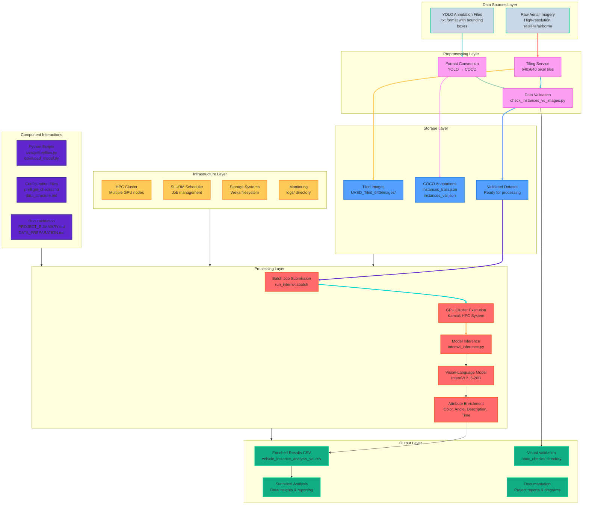
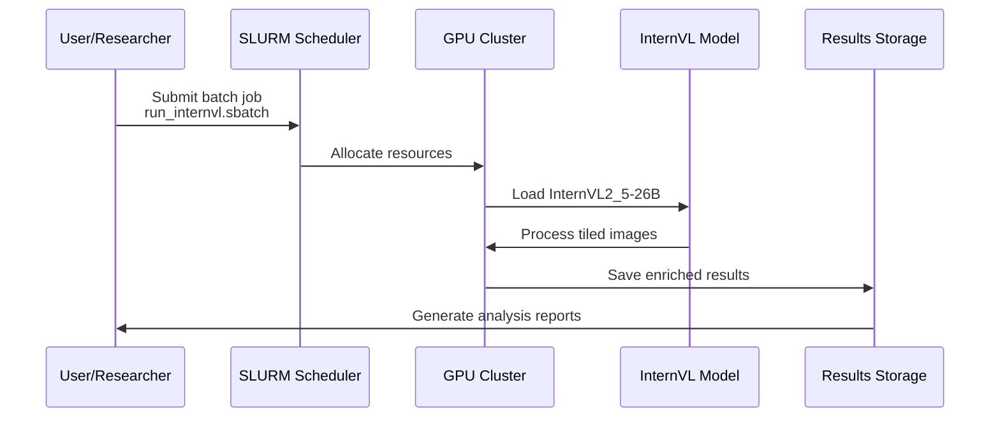

# UVSD Enrichment Complete System Diagram

## Overview
This diagram provides a comprehensive visualization of the UVSD Enrichment pipeline architecture, data flow, and system components.

## Complete System Architecture Diagram

## Detailed Component Description

### Data Sources Layer
- **Raw Aerial Imagery**: High-resolution satellite/airborne images
- **YOLO Annotation Files**: Pre-labeled bounding boxes in YOLO format

### Preprocessing Layer
1. **Tiling Service**: Converts large images to 640x640 pixel tiles
2. **Format Conversion**: Transforms YOLO annotations to COCO format
3. **Data Validation**: Validates image-annotation consistency

### Storage Layer
1. **Tiled Images**: Organized in train/val directories
2. **COCO Annotations**: JSON files with instance data
3. **Validated Dataset**: Quality-checked ready dataset

### Processing Layer
1. **Batch Submission**: SLURM job scheduling
2. **GPU Execution**: HPC cluster with GPU acceleration
3. **Model Inference**: InternVL vision-language model
4. **Attribute Enrichment**: Color, angle, description, time analysis

### Output Layer
1. **Enriched Results**: CSV files with vehicle attributes
2. **Statistical Analysis**: Data insights and reporting
3. **Visual Validation**: Bounding box verification images
4. **Documentation**: Project reports and system diagrams

### Infrastructure Layer
- HPC Cluster with GPU nodes
- SLURM job scheduler
- Weka filesystem storage
- Comprehensive monitoring system

## Data Flow Sequence

## Key Technical Specifications

| Component | Specification | Purpose |
|-----------|---------------|---------|
| **Image Tiling** | 640x640 pixels | Standardize input size |
| **Model** | InternVL2_5-26B | Vision-language inference |
| **GPU** | H100/A100/Tesla | Accelerated processing |
| **Storage** | Weka filesystem | High-performance storage |
| **Output Format** | CSV with attributes | Structured results |
| **Validation** | Bounding box checks | Quality assurance |

## Usage Instructions

1. **View in VS Code**: Install "Mermaid Preview" extension
2. **View on GitHub**: Diagrams render automatically
3. **Edit**: Modify the Mermaid code to update the diagram
4. **Export**: Use Mermaid Live Editor for PNG/SVG export

This diagram provides a complete visual representation of your UVSD Enrichment pipeline architecture.