# UVSD Enrichment Simple Pipeline Diagram

## Overview
A clean, simple diagram showing the core UVSD Enrichment pipeline flow.

## Simple Pipeline Diagram

```mermaid
graph TD
    %% Input Layer
    A[📷 Raw Aerial Images] --> B[✂️ Image Tiling<br/>640x640 tiles]
    C[📄 YOLO Labels] --> D[🔄 Format Conversion<br/>YOLO → COCO]
    
    %% Processing Layer
    B --> E[✅ Data Validation<br/>check_instances_vs_images.py]
    D --> E
    E --> F[⚡ Model Inference<br/>internvl_inference.py]
    F --> G[🤖 InternVL2 Model<br/>26B Parameters]
    
    %% Enrichment Layer
    G --> H[🎨 Attribute Enrichment]
    H --> I[🔍 Color Detection]
    H --> J[📐 Angle Estimation]
    H --> K[📝 Description Generation]
    H --> L[⏰ Time Analysis]
    
    %% Output Layer
    I --> M[📊 Results CSV]
    J --> M
    K --> M
    L --> M
    M --> N[📈 Data Analysis]
    N --> O[📋 Reports & Visualizations]
    
    %% Infrastructure
    P[🖥️ HPC Cluster] --> F
    Q[📁 Storage System] --> M
    
    %% Styling
    linkStyle 0 stroke:#ff6b6b,stroke-width:2px
    linkStyle 1 stroke:#4ecdc4,stroke-width:2px
    linkStyle 2 stroke:#45b7d1,stroke-width:2px
    linkStyle 3 stroke:#96ceb4,stroke-width:2px
    linkStyle 4 stroke:#feca57,stroke-width:2px
    linkStyle 5 stroke:#ff9ff3,stroke-width:2px
    linkStyle 6 stroke:#54a0ff,stroke-width:2px
    linkStyle 7 stroke:#5f27cd,stroke-width:2px
    linkStyle 8 stroke:#00d2d3,stroke-width:2px
    linkStyle 9 stroke:#ff9f43,stroke-width:2px
    
    classDef input fill:#c8d6e5,stroke:#1dd1a1,stroke-width:2px
    classDef process fill:#ff9ff3,stroke:#f368e0,stroke-width:2px
    classDef model fill:#ff6b6b,stroke:#ee5a24,stroke-width:2px
    classDef enrich fill:#54a0ff,stroke:#2e86de,stroke-width:2px
    classDef output fill:#10ac84,stroke:#1dd1a1,stroke-width:2px
    classDef infra fill:#feca57,stroke:#ff9f43,stroke-width:2px
    
    class A,C input
    class B,D,E,F process
    class G model
    class H,I,J,K,L enrich
    class M,N,O output
    class P,Q infra
```



## Alternative: Timeline View


## Alternative: Gantt Chart


## Alternative: Class Diagram


## Quick View Commands

```bash
# View the diagram in terminal
cat /data/lab/lapin/UVSD_Enrichment/Documentation/uvsd_simple_diagram.md

# Copy Mermaid code to clipboard
cat /data/lab/lapin/UVSD_Enrichment/Documentation/uvsd_simple_diagram.md | grep -A 100 "```mermaid" | grep -B 100 "```" | tail -n +2 | head -n -1
```

## How to Use

1. **VS Code**: Install "Mermaid Preview" extension
2. **GitHub**: Diagrams render automatically in markdown files
3. **Online**: Copy to [Mermaid Live Editor](https://mermaid.live/)
4. **Export**: Save as PNG/SVG from online editor

Choose the diagram style that best fits your needs!